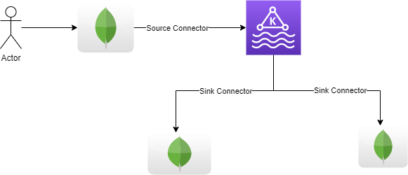

# MongoDB Connector for Apache Kafka Tutorials

The official MongoDB Connector for Apache® Kafka® is developed and supported by MongoDB engineers and verified by Confluent. The Connector is designed to be used with Kafka Connect and enables MongoDB to be a datasource for Apache Kafka from both a source and sink perspective.


These tutorials are focused on teaching you the essential features and functionality of the connector enabling you to get up and running quickly.

# Prerequisites

The MongoDB Kafka tutorial environment requires the following installed on your client:

- [Docker](https://docs.docker.com/get-docker/)
- [Git]()

The docker compose in this repository will create an environment that consists of the following:

- Apache Kafka
- Zookeeper
- Apache Kafka Connect
- MongoDB Connector for Apache Kafka (installed in Kafka Connect)
- MongoDB single node replica set

# Starting the Docker environment

To start the baseline tutorial environment execute the run the following command:

```
docker-compose up
```

Now, go to ```mongo1``` container:


To start an interactive shell, run the following command:

```
docker exec -it mongo1 /bin/bash
```
## Goal
Now our goal is that:
1. First we insert a record/collection into first instance of mongoDB {USE: `db.<collection>.insertOne()`}.
2. Collection inserted into MongoDB will be sent as a message to Kafka Topic{USE: `MongoDB Kafka Source Connector`}.
3. Messages from Kafka Topic will be send to the second & third mongoDB instances {USE: `MongoDB Kafka Sink Connector`}.

### Architecture Flow

#### Step 1:
On MongoDB first instance container, run the following:</br>
```
MongoDB Kafka Sandbox $pwd
/tutorials/source_connector
MongoDB Kafka Sandbox $cx simple_source_mongo1.json
{
  "name": "mongo-simple-source",
  "config": {
    "connector.class": "com.mongodb.kafka.connect.MongoSourceConnector",
    "connection.uri": "mongodb://mongo1",
    "publish.full.document.only": "true",
    "database": "Tutorial1",
    "collection": "orders",
    "name": "mongo-simple-source"
  },
  "tasks": [],
  "type": "source"
}
```
#### Step 2:
Insert a document into `orders` collection in `Tutorial1` DataBase.
```
rs1 [direct: primary] test> use Tutorial1;
switched to db Tutorial1
rs1 [direct: primary] Tutorial1> db.orders.insertOne({'id':1, 'name':'Book'})
{
  acknowledged: true,
  insertedId: ObjectId("65200452634057331201d16e")
}
rs1 [direct: primary] Tutorial1> db.orders.find()
[ { _id: ObjectId("65200452634057331201d16e"), id: 1, name: 'Book' } ]
```
#### Step 3:
Now check the messages in the kafka topic. </br>
```
MongoDB Kafka Sandbox $kc Tutorial1.orders
% Auto-selecting Consumer mode (use -P or -C to override)

Partition: 0    Offset: 0

Key (109 bytes):

{"schema":{"type":"string","optional":false},"payload":"{\"_id\": {\"$oid\": \"65200452634057331201d16e\"}}"}

Value (140 bytes):

{"schema":{"type":"string","optional":false},"payload":"{\"_id\": {\"$oid\": \"65200452634057331201d16e\"}, \"id\": 1, \"name\": \"Book\"}"}
```

#### Step 4:
Now, go to sencond or third instance of MongoDB shell.

```
rs2 [direct: primary] test> show dbs;
admin    80.00 KiB
config  164.00 KiB
local   404.00 KiB
```

#### Step 5:
Now create sink connector:
```
MongoDB Kafka Sandbox $pwd
/tutorials/sink_connector
MongoDB Kafka Sandbox $cx simple_sink2.json
{
  "name": "mongo-tutorial-sink2",
  "config": {
    "connector.class": "com.mongodb.kafka.connect.MongoSinkConnector",
    "topics": "Tutorial1.orders",
    "connection.uri": "mongodb://mongo2",
    "key.converter": "org.apache.kafka.connect.storage.StringConverter",
    "value.converter": "org.apache.kafka.connect.json.JsonConverter",
    "value.converter.schemas.enable": "false",
    "database": "Tutorial1",
    "collection": "orders",
    "name": "mongo-tutorial-sink2"
  },
  "tasks": [],
  "type": "sink"
}
```

#### Step 6:
Go to mongoDB shell and run the below commands:
```
rs2 [direct: primary] test> show dbs;
Tutorial1   40.00 KiB
admin       80.00 KiB
config     244.00 KiB
local      404.00 KiB
rs2 [direct: primary] test> use Tutorial1;
switched to db Tutorial1
rs2 [direct: primary] Tutorial1> db.orders.find()
[
  {
    _id: ObjectId("6520057c7e7aec62971bc720"),
    schema: { optional: false, type: 'string' },
    payload: '{"_id": {"$oid": "65200452634057331201d16e"}, "id": 1, "name": "Book"}'
  }
]
```

## Shutting down the Tutorial environment

To stop and remove the Docker environment from your
machine, run the following command:

```
docker-compose -p mongo-kafka down --rmi 'all'
```

## References

- [MongoDB Kafka Source Connector](https://www.mongodb.com/docs/kafka-connector/current/tutorials/source-connector/) online documentation.

- [MongoDB Kafka Sink Connector](https://www.mongodb.com/docs/kafka-connector/current/tutorials/sink-connector)
